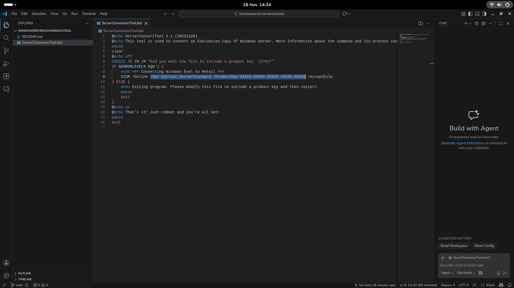

# Windows Eval to Retail Conversion Tool 
This tool is designed to aid in the process of converting an Evaluation copy of Windows Server from Evaluation to Retail. The idea is that it automates the commands responsible for doing so. It's as easy as editing the batch file to include the Set-Edition and ProductKey so that the tool can work successfully. 
## How to use 
Before running this script, you must edit two strings shown in the photo below

Once you have done so you should be able to run the script in Windows Terminal, Command Prompt or PowerShell. 
## License
You are free to use the code, share it, modify it, and distribute it as you please. This project was based on official Microsoft documentation that includes step-by-step instructions on the process and how it works, of which you can find [here](https://learn.microsoft.com/en-us/windows-server/get-started/upgrade-conversion-options).
# NOTE
This tool is only used to change the SKU type, Product Key and Edition of the Windows Server Operating System. It is NOT an activation tool, and is not intended for activation purposes. 

If you use a Volume License or Setup Key, it will NOT activate without either an activation server, or an appropriate key that will activate with Microsoft servers. If you use a Retail Key, you should have no problem activating Windows using the Settings app or slmgr.
